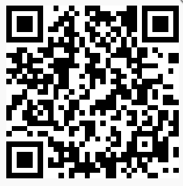

# EasyVideoRecorder #

EasyVideoRecorder是EasyDarwin开源团队成员Holo & Carl开发的一款移动端短视频拍摄工具库，类似于美拍、秒拍的短视频拍摄功能，支持按住拍、点击拍、滤镜、mv、相框、图片序列合成、照片合成mv(开发中)、视频水印、本地视频导入(开发中)功能，并且功能还在不断扩展中,未来将会有更多diao爆了的功能上线！开源团队成员经过多年技术积累，开发出的拍摄库支持Android、IOS平台，适配性好，比同行业的视频合成技术在：速度，稳定性，丰富性，适配性上都具有一定的技术优势！

- 拍摄 
- 断点拍摄
- 回删
- 摄像头切换
- 自动焦距调节
- 滤镜
- MV
- 相框
- 图片序列合成
- 关闭原音
- 背景音乐
- 视频水印
- 不断扩展中…

**EasyVideoRecorder SDK库企业及商用需要经过授权(Github Demo中的SDK授权截止日期为：2016年10月1日，届时会重新更新授权Demo版本的授权时间周期)，EasyVideoRecorder SDK支持自定义滤镜、MV、相框**，<a href="http://www.easydss.com/EasyVideoRecorder.html" alt="EasyVideoRecorder 授权说明" target="_blank">授权说明：http://www.easydss.com/EasyVideoRecorder.html</a>；

## DEMO ##

Android:

IOS:

## 获取更多信息 ##

邮件：[Johnson@easydarwin.org](mailto:Johnson@easydarwin.org) 

WEB：[www.EasyDarwin.org](http://www.easydarwin.org)

Author：Holo & Carl

QQ交流群：[201790130](http://jq.qq.com/?_wv=1027&k=2Fz1eP2 "EasyVideoRecorder短视频SDK")

Copyright &copy; EasyDarwin.ORG 2012-2016

